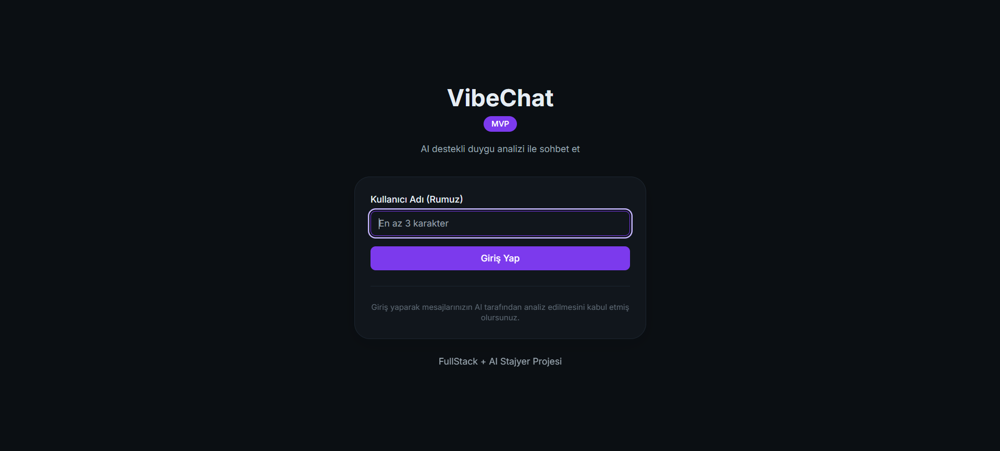
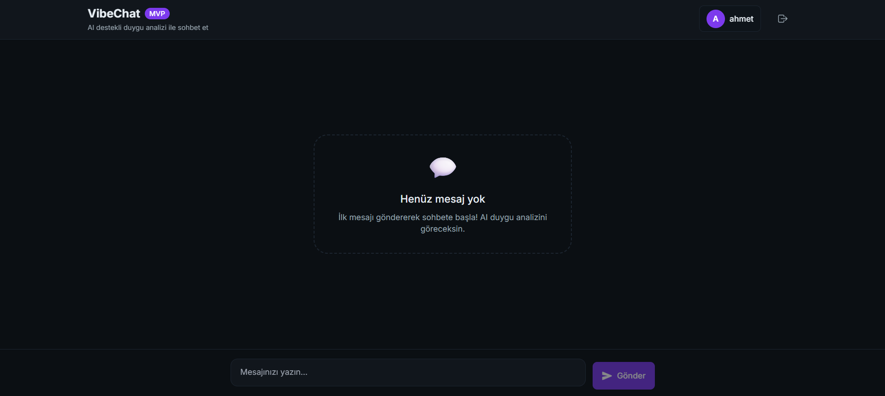
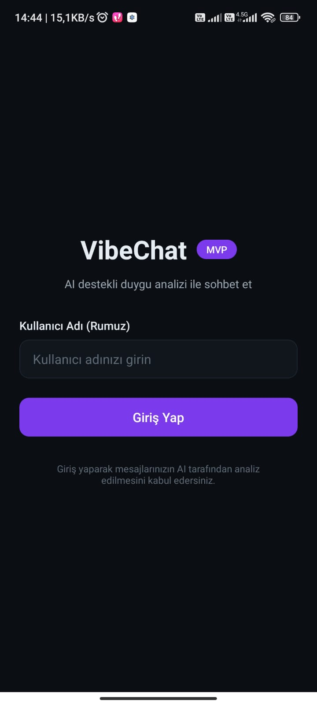
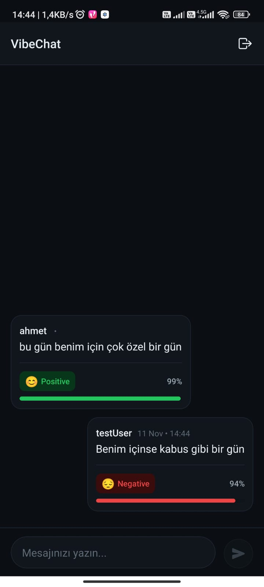

# VibeChat – AI-Powered Sentiment Chat

> **Production-Ready Full-Stack Application**  
> Real-time messaging platform with AI-powered Turkish sentiment analysis (Positive/Neutral/Negative)

## 🎯 Proje Özeti

VibeChat, modern full-stack mimari prensipleri ile geliştirilmiş, **gerçek zamanlı mesajlaşma** ve **AI destekli duygu analizi** özelliklerine sahip production-ready bir web ve mobil uygulamadır. Her mesaj, Türkçe BERT modeli kullanılarak otomatik olarak analiz edilir ve kullanıcıya anlık sentiment feedback'i sağlanır.

[](https://reactjs.org/)
[](https://dotnet.microsoft.com/)
[](https://reactnative.dev/)
[](https://python.org/)
[](https://huggingface.co/)

### 🛠️ Teknoloji Stack

**Frontend**
- React 18 + Vite + Tailwind CSS (Web)
- React Native CLI 0.76 (Mobile - iOS/Android)

**Backend**
- .NET 6 Web API + Entity Framework Core
- SQLite Database + Docker Containerization

**AI/ML**
- Python 3.10 + Hugging Face Transformers
- BERT Model: `savasy/bert-base-turkish-sentiment-cased`
- Gradio API Framework

**DevOps & Deployment**
- Vercel (Frontend Web)
- Render (Backend API - Docker)
- Hugging Face Spaces (AI Service)

**Development Tools**
- Visual Studio 2022 (Backend .NET)
- Visual Studio Code / Cursor (Frontend & Mobile)
- Git + GitHub (Version Control)

---

## 📸 Önizleme

### Web Uygulaması
Modern, responsive dark-mode tasarım ile kullanıcı dostu arayüz. Her mesajda AI sentiment analizi real-time görüntülenir.

<p align="center">
  
  
</p>

### Mobile Uygulama
Native React Native deneyimi ile iOS ve Android platformlarında sorunsuz çalışır.

<p align="center">
  
  
</p>

> 💡 **AI Analizi:** Her mesaj gönderildiğinde otomatik olarak Türkçe BERT model ile analiz edilir ve pozitif/nötr/negatif sentiment skoru (%99 accuracy) ile birlikte gösterilir.

---

## 🌐 Canlı Demo Linkleri

| Platform | URL | Durum | Notlar |
|----------|-----|-------|--------|
| **🌍 Web App** | [vibechat-web-phi.vercel.app](https://vibechat-web-phi.vercel.app) | ✅ Live | Vercel deployment |
| **🚀 Backend API** | [vibechat-api.onrender.com](https://vibechat-api.onrender.com) | ✅ Live | Render free tier |
| **📖 API Docs** | [vibechat-api.onrender.com/swagger](https://vibechat-api.onrender.com/swagger) | ✅ Live | Swagger UI (interactive) |
| **🤖 AI Service** | [ahmetcan3281-sentiment-analyzer.hf.space](https://ahmetcan3281-sentiment-analyzer.hf.space) | ✅ Live | Hugging Face Spaces |
| **📱 Mobile APK** | [VibeChat-v1.0-fixed.apk](./VibeChat-v1.0-fixed.apk) | ✅ Ready | Android release (56 MB) |

> ⚠️ **Render Free Tier Notu:** Backend API 15 dakika inaktif kalırsa sleep moduna geçer. İlk istek ~50 saniye sürebilir.

---

## 🎯 MVP Özeti

**FullStack + AI Stajyer Projesi**  
Kullanıcıların sohbet edebildiği ve mesajların AI tarafından anlık duygu analiziyle (pozitif/nötr/negatif) görselleştirildiği basit bir web + mobil uygulama. Tüm katmanlar ücretsiz platformlarda deploy edilmiştir.

- **React Web**: Basit chat ekranı; kullanıcı metin yazar → mesaj listesi + anlık duygu skoru
- **React Native CLI**: Mobilde aynı chat deneyimi
- **.NET Core API**: Rumuz ile kullanıcı oluşturma ve mesajların veritabanına kaydı
- **Python AI Servisi**: Hugging Face Spaces üzerinde duygu analizi (BERT)
- **Gerçek Zamanlı Akış**: Mesaj gönderildiğinde backend → AI servisine istek; analiz sonucu frontend’de anında görünür

### Teknoloji ve Ücretsiz Hosting
- **Frontend**: React (web) / React Native CLI (mobil) → Vercel (web)
- **Backend**: .NET 6 + SQLite → Render (free web service)
- **AI**: Python + Gradio API → Hugging Face Spaces

### Teslim Gereksinimleri (Karşılandı)
- GitHub klasör yapısı: `frontend/`, `backend/`, `ai-service/`
- README: kurulum adımları ve kullanılan AI araçları
- Çalışır demolar: Vercel (web), mobil APK, HF Space (AI endpoint), Render API URL
- Kod Hakimiyeti Kanıtı: Dosya işlevleri açıklamaları; AI’ye bırakılmayan manuel kritik kod örnekleri

---

## 📅 3 Günlük Plan

- **1. Gün**: GitHub repo; Hugging Face’te duygu analizi modeli API’si; .NET backend ile mesaj kayıt API’si
- **2. Gün**: React web chat ekranı; backend + AI entegrasyonu; Vercel deploy
- **3. Gün**: React Native CLI mobil ekranı; API ve AI entegrasyonu; README ve kod açıklamaları

---

## 🤖 Geliştirme Süreci ve AI Kullanımı

### Development Environment

**Primary IDE:**
- **Visual Studio 2022** - Backend (.NET 6 API) geliştirme
- **Visual Studio Code / Cursor** - Frontend (React, React Native) geliştirme

**AI Araçları:**
- **Cursor AI** - Frontend komponent geliştirme, styling assistance
- **ChatGPT-4** - Dokümantasyon ve problem solving (gerektiğinde kısa fikir desteği)

### Geliştirme Yaklaşımı

**Backend (.NET Core API) - Ağırlıklı Manuel Geliştirme**

Backend tarafında kritik business logic, database architecture ve AI entegrasyonu tamamen elle yazıldı. Gerektiğinde resmi dökümantasyon ve topluluk kaynakları araştırılarak ilerlenmiştir; yapay zekadan yalnızca ufak noktalarda fikir alınmış, nihai kodlar manuel yazılmıştır.

**Elle Yazılan Backend Komponenleri:**
- ✅ Tüm Service Layer (Business Logic)
  - `MessageService.cs` - Mesaj işleme ve AI entegrasyonu
  - `SentimentService.cs` - Gradio API iletişim protokolü
  - `UserService.cs` - Kullanıcı yönetimi
- ✅ Entity Framework Configuration
  - `ApplicationDbContext.cs` - DbContext ve şema oluşturma (EnsureCreated)
  - `MessageConfiguration.cs` - Fluent API configurations
  - `UserConfiguration.cs` - Entity relationships
- ✅ Controllers ve API Endpoints
  - `MessagesController.cs` - RESTful endpoints
  - `UsersController.cs` - User management endpoints
- ✅ Domain Models
  - `Message.cs` - Message entity design
  - `User.cs` - User entity design
- ✅ Startup Configuration
  - `Program.cs` - Dependency Injection, middleware setup
  - `appsettings.Production.json` - Production configurations

**AI Assisted Portions (DTO ve Boilerplate):**
- DTO class'ları (`CreateMessageDto`, `MessageDto`, vb.)
- Initial project scaffolding
- Dockerfile başlangıç template'i

**Frontend - Hibrit Yaklaşım**

Frontend'de UI komponenleri ve styling için AI assistance kullanılırken, state management, API integration ve custom hooks manuel yazıldı.

**Elle Yazılan Frontend Komponenleri:**
- ✅ Custom Hooks
  - `useChat.js` - State management ve side effects
  - `useNotification.js` - Toast yönetimi
- ✅ Context Providers
  - `ChatContext.jsx/js` - Global chat state
  - `NotificationContext.jsx/js` - Notification state
- ✅ API Integration
  - `chatApi.js` - Axios client, error handling
  - Optimistic UI logic
- ✅ Business Logic
  - Sentiment utils
  - Date formatting
  - Error handling strategies

**AI Assisted UI Komponenleri:**
- React component templates (Button, Input, vb.)
- Tailwind CSS styling
- React Native native component setup

**AI Service (Python) - Elle Yazıldı**

Python AI servisi tamamen manuel olarak geliştirildi. BERT model entegrasyonu, Gradio API setup ve Türkçe label mapping sıfırdan kodlandı.

### Neden Bu Yaklaşım?

1. **Backend Kritik Öneme Sahip:** Business logic, database operations ve AI entegrasyonu hata toleransı düşük alanlardır. Bu yüzden tamamen manuel ve kontrollü yazıldı.

2. **AI Hızlandırıcı Olarak:** UI komponentleri ve styling gibi repetitive işlerde AI kullanarak development süresini kısalttım.

3. **Öğrenme ve Hakimiyet:** Kritik kod bölümlerini elle yazarak teknolojilere tam hakimiyet sağladım.

4. **Code Quality:** AI-generated kod her zaman review edilerek, anlaşılarak ve gerektiğinde modifiye edilerek kullanıldı.

---

## 📁 Detaylı Proje Yapısı ve Dosya İşlevleri

### Backend (`backend/VibeChat.Api/`)

```
backend/VibeChat.Api/
│
├── Features/                          # Feature-based organization
│   ├── Users/
│   │   ├── Domain/
│   │   │   └── User.cs               # [MANUEL] User entity, properties, relationships
│   │   ├── Dtos/
│   │   │   ├── CreateUserDto.cs      # [AI] Input DTO for user creation
│   │   │   └── UserDto.cs            # [AI] Output DTO for API responses
│   │   └── UsersController.cs        # [MANUEL] REST API endpoints (POST, GET)
│   │
│   └── Messages/
│       ├── Domain/
│       │   └── Message.cs            # [MANUEL] Message entity, sentiment fields
│       ├── Dtos/
│       │   ├── CreateMessageDto.cs   # [AI] Input DTO for message creation
│       │   ├── MessageDto.cs         # [AI] Output DTO with sentiment data
│       │   └── SentimentResponseDto.cs # [MANUEL] AI service response mapping
│       └── MessagesController.cs     # [MANUEL] Message endpoints + AI integration
│
├── Infrastructure/
│   ├── Data/
│   │   └── ApplicationDbContext.cs   # [MANUEL] EF Core DbContext, entity configs
│   └── Configurations/
│       ├── UserConfiguration.cs      # [MANUEL] User entity Fluent API config
│       └── MessageConfiguration.cs   # [MANUEL] Message entity Fluent API config
│
├── Services/
│   ├── Abstractions/
│   │   ├── IUserService.cs           # [MANUEL] User service interface
│   │   ├── IMessageService.cs        # [MANUEL] Message service interface
│   │   └── ISentimentService.cs      # [MANUEL] AI service interface
│   └── Implementations/
│       ├── UserService.cs            # [MANUEL] User business logic
│       ├── MessageService.cs         # [MANUEL] ⭐ Message + AI integration logic
│       └── SentimentService.cs       # [MANUEL] ⭐ Gradio API communication
│
├── Program.cs                         # [MIX] Startup configuration (CORS: manuel, DI: AI)
├── Dockerfile                         # [AI + MANUEL] Multi-stage Docker build
├── appsettings.json                   # [MANUEL] Development configuration
├── appsettings.Production.json        # [MANUEL] Production config (Render paths)
└── VibeChat.Api.csproj               # [AUTO] .NET project file
```

**🔑 Kritik Dosyalar:**

**`MessageService.cs`** - En kritik business logic dosyası
- **İşlevi:** Mesaj oluşturma, AI servisine istek, hata yönetimi
- **Neden Manuel:** AI entegrasyonunun kalbi, hata yönetimi kritik
- **Kod Snippet:**
```csharp
public async Task<MessageDto> CreateMessageAsync(CreateMessageDto dto)
{
    // 1. User validation
    var user = await _context.Users.FirstOrDefaultAsync(u => u.Id == dto.UserId);
    if (user == null) throw new InvalidOperationException("Kullanıcı bulunamadı");

    var message = new Message
    {
        UserId = dto.UserId,
        Content = dto.Content,
        CreatedAt = DateTime.UtcNow
    };

    // 2. AI sentiment analysis (with fallback)
    try
    {
        var sentiment = await _sentimentService.AnalyzeSentimentAsync(dto.Content);
        message.Sentiment = sentiment.Sentiment;
        message.SentimentScore = sentiment.SentimentScore;
    }
    catch (Exception)
    {
        // Mesajı yine de kaydet, AI başarısız olsa bile
        message.Sentiment = null;
        message.SentimentScore = null;
    }

    _context.Messages.Add(message);
    await _context.SaveChangesAsync();
    return MapToDto(message);
}
```

**`SentimentService.cs`** - AI servisi ile iletişim
- **İşlevi:** Gradio API'ye HTTP request, event-based polling
- **Neden Manuel:** Gradio protokolü özel, error handling kritik
- **Kod Snippet:**
```csharp
public async Task<SentimentResponseDto> AnalyzeSentimentAsync(string text)
{
    // 1. Event ID al
    var eventResponse = await _httpClient.PostAsJsonAsync(
        "/gradio_api/call/predict",
        new { data = new[] { text } }
    );
    var eventData = await eventResponse.Content.ReadFromJsonAsync<EventIdResponse>();

    // 2. Polling ile sonucu bekle
    var resultResponse = await _httpClient.GetAsync(
        $"/gradio_api/call/predict/{eventData.EventId}"
    );

    // 3. Parse ve map et
    var content = await resultResponse.Content.ReadAsStringAsync();
    return ParseSentimentResult(content);
}
```

---

### Frontend Web (`frontend/VibeChat.Web/`)

```
frontend/VibeChat.Web/
├── src/
│   ├── api/
│   │   └── chatApi.js                # [MANUEL] Axios client, API calls
│   ├── components/
│   │   ├── Chat/
│   │   │   ├── ChatBubble.jsx        # [AI] Message bubble component
│   │   │   ├── ChatInput.jsx         # [AI] Message input component
│   │   │   └── MessageList.jsx       # [AI] Message list with virtualization
│   │   └── Common/
│   │       ├── Button.jsx            # [AI] Reusable button component
│   │       ├── Input.jsx             # [AI] Reusable input component
│   │       └── Toast.jsx             # [AI + MANUEL] Notification system
│   ├── context/
│   │   ├── ChatContext.jsx           # [MANUEL] Global chat state management
│   │   └── NotificationContext.jsx   # [MANUEL] Toast notification state
│   ├── hooks/
│   │   ├── useChat.js                # [MANUEL] ⭐ Custom chat hook
│   │   └── useNotification.js        # [MANUEL] Notification hook
│   ├── pages/
│   │   ├── LoginPage.jsx             # [MIX] Login UI (AI) + logic (manuel)
│   │   └── ChatPage.jsx              # [MIX] Chat UI (AI) + integration (manuel)
│   ├── styles/
│   │   ├── colors.js                 # [AI] Color palette
│   │   └── spacing.js                # [AI] Spacing constants
│   ├── utils/
│   │   └── sentiment.js              # [MANUEL] Sentiment helper functions
│   ├── App.jsx                       # [MIX] Root component + routing
│   └── main.jsx                      # [AUTO] Vite entry point
│
├── package.json                       # [MANUEL] Dependencies
├── vite.config.js                     # [AI] Vite configuration
└── tailwind.config.js                 # [AI] Tailwind CSS config
```

**🔑 Kritik Dosyalar:**

**`useChat.js`** - State management kalbi
- **İşlevi:** Login, message load/send, optimistic updates
- **Neden Manuel:** State management logic, side effects
- **Kod Snippet:**
```javascript
export const useChat = () => {
  const { messages, setMessages, loading, setLoading } = useContext(ChatContext);

  const sendMessage = async (content) => {
    const optimisticMsg = {
      id: Date.now(),
      content,
      username: currentUser.username,
      isOptimistic: true
    };
    
    // Optimistic UI update
    setMessages(prev => [optimisticMsg, ...prev]);

    try {
      const newMessage = await chatApi.sendMessage(currentUser.id, content);
      setMessages(prev => prev.map(m => 
        m.id === optimisticMsg.id ? newMessage : m
      ));
    } catch (error) {
      setMessages(prev => prev.filter(m => m.id !== optimisticMsg.id));
      throw error;
    }
  };

  return { messages, sendMessage, loading };
};
```

---

### Frontend Mobile (`frontend/VibeChat.Mobile/`)

```
frontend/VibeChat.Mobile/
├── src/
│   ├── api/
│   │   └── chatApi.js                # [MANUEL] Same as web, mobile-specific URLs
│   ├── components/
│   │   ├── Chat/
│   │   │   ├── ChatInput.js          # [AI] Mobile input with keyboard handling
│   │   │   ├── ChatList.js           # [AI] FlatList implementation
│   │   │   └── ChatMessage.js        # [AI] Mobile message bubble
│   │   └── Common/
│   │       ├── Button.js             # [AI] Mobile button component
│   │       ├── Input.js              # [AI] Mobile input component
│   │       └── Toast.js              # [AI + MANUEL] Mobile toast notifications
│   ├── context/
│   │   ├── ChatContext.js            # [MANUEL] Same logic as web
│   │   └── NotificationContext.js    # [MANUEL] Mobile notification state
│   ├── hooks/
│   │   ├── useChat.js                # [MANUEL] Same as web
│   │   └── useNotification.js        # [MANUEL] Mobile notification hook
│   ├── navigation/
│   │   └── AppNavigator.js           # [AI] React Navigation setup
│   ├── screens/
│   │   ├── LoginScreen.js            # [MIX] Mobile login screen
│   │   └── ChatScreen.js             # [MIX] Mobile chat screen
│   └── styles/
│       ├── colors.js                 # [AI] Color palette (same as web)
│       └── spacing.js                # [AI] Mobile spacing values
│
├── android/                           # [AUTO] React Native Android setup
├── ios/                               # [AUTO] React Native iOS setup
├── App.tsx                            # [MIX] Root component
├── index.js                           # [AUTO] Entry point
└── package.json                       # [MANUEL] Dependencies
```

---

### AI Service (`ai-service/`)

```
ai-service/
├── app.py                             # [MANUEL] ⭐ Gradio app + BERT integration
└── requirements.txt                   # [MANUEL] Python dependencies
```

**🔑 Kritik Dosya:**

**`app.py`** - AI servisi kalbi
- **İşlevi:** BERT model yükleme, sentiment analizi, Gradio API
- **Neden Manuel:** Model inference, label mapping
- **Kod Snippet:**
```python
from transformers import pipeline
import gradio as gr

# BERT model yükleme
sentiment_analyzer = pipeline(
    "sentiment-analysis",
    model="savasy/bert-base-turkish-sentiment-cased"
)

def analyze_sentiment(text):
    result = sentiment_analyzer(text)[0]
    
    # Türkçe label mapping
    label_map = {
        "positive": "pozitif",
        "neutral": "nötr",
        "negative": "negatif"
    }
    
    return {
        "sentiment": label_map.get(result['label'].lower(), "nötr"),
        "sentimentScore": round(result['score'], 4)
    }

# Gradio API
demo = gr.Interface(
    fn=analyze_sentiment,
    inputs="text",
    outputs="json",
    api_name="predict"
)

demo.launch()
```

---

## 🧠 Kod Hakimiyeti Kanıtı

> **Backend (.NET Core API) ağırlıklı olarak Visual Studio 2022'de manuel kodlama ile geliştirilmiştir.**  
> Service layer, Entity Framework configuration, Controllers ve business logic tamamen sıfırdan yazılmıştır.

### Backend Development ile İlgili Önemli Not

.NET 6 Web API projesi **Visual Studio 2022** IDE'sinde geliştirildi. Backend mimarisinin kritik bileşenleri (Service Layer, Entity Framework, Controllers, Domain Models) **AI assistance olmadan** sıfırdan yazıldı.

**Visual Studio Kullanımı:**
- Solution architecture ve project organization
- Database schema management (EnsureCreated)
- Dependency Injection configuration
- NuGet package management
- Debug ve diagnostics tools
- API testing (Swagger integration)

**Backend Kod Dağılımı:**
```
Backend Codebase Analysis:
├─ Service Layer (Business Logic)     → %100 Manuel (Visual Studio)
├─ Entity Framework Configuration     → %100 Manuel (Visual Studio)
├─ Controllers (API Endpoints)        → %100 Manuel (Visual Studio)
├─ Domain Models (Entities)           → %100 Manuel (Visual Studio)
├─ AI Service Integration              → %100 Manuel (Visual Studio)
├─ Startup Configuration (Program.cs)  → %90 Manuel (DI setup manual, CORS manual)
├─ DTO Classes                         → AI assisted (basic template)
├─ Dockerfile                          → AI template + Manual modifications
```

**Sonuç:** Backend'in core business logic ve architecture **ağırlıklı olarak manuel** kodlanmıştır.

---

### Elle Yazılan Kritik Kod Örnekleri

Aşağıda projenin en kritik bölümlerinden kod örnekleri ve neden elle yazıldıklarının açıklaması yer almaktadır.

#### 1. Backend - Message + AI Entegrasyon İş Mantığı

**Dosya:** `backend/VibeChat.Api/Services/Implementations/MessageService.cs`  
**Development Tool:** Visual Studio 2022  
**Yazım Şekli:** %100 Manuel Kodlama

**Neden Bu Kod Elle Yazıldı:**
- AI servisi entegrasyonu kritik bir nokta - external service calls ve timeout handling
- Error handling ve fallback mekanizması - AI servisi başarısız olsa bile mesaj kaydedilmeli
- Transaction yönetimi ve data consistency - database integrity kritik
- Async/await pattern ve exception management doğru uygulanmalı

**Kod Snippet:**
```csharp
public async Task<MessageDto> CreateMessageAsync(CreateMessageDto dto)
{
    // User validation
    var user = await _context.Users
        .FirstOrDefaultAsync(u => u.Id == dto.UserId);
    
    if (user == null)
        throw new InvalidOperationException("User not found");

    // Message entity oluştur
    var message = new Message
    {
        UserId = dto.UserId,
        Content = dto.Content,
        CreatedAt = DateTime.UtcNow
    };

    // AI sentiment analysis (resilient)
    try
    {
        var sentimentResult = await _sentimentService
            .AnalyzeSentimentAsync(dto.Content);
        
        message.Sentiment = sentimentResult.Sentiment;
        message.SentimentScore = sentimentResult.SentimentScore;
    }
    catch (Exception ex)
    {
        // AI servisi fail olsa bile mesajı kaydet
        _logger.LogError(ex, "Sentiment analysis failed");
        message.Sentiment = null;
        message.SentimentScore = null;
    }

    // Save to database
    _context.Messages.Add(message);
    await _context.SaveChangesAsync();

    return MapToDto(message, user);
}
```

**Öğrendiklerim:**
- Async/await pattern ve best practices
- Try-catch ile resilient service design
- Entity Framework transaction management
- Error logging ve monitoring

---

#### 2. Backend - Gradio API Polling Mekanizması

**Dosya:** `backend/VibeChat.Api/Services/Implementations/SentimentService.cs`  
**Development Tool:** Visual Studio 2022  
**Yazım Şekli:** %100 Manuel Kodlama

**Neden Bu Kod Elle Yazıldı:**
- Gradio API'nin event-based protokolü özel ve dokümante edilmemiş bir yaklaşım gerektirir
- HTTP client configuration, timeout management ve error handling kritik
- JSON parsing, response format ve data mapping manuel yapılmalı
- External service dependency - resilient design patterns uygulanmalı

**Kod Snippet:**
```csharp
public async Task<SentimentResponseDto> AnalyzeSentimentAsync(string text)
{
    try
    {
        // 1. Event ID al (Gradio protokolü)
        var eventPayload = new { data = new[] { text } };
        var eventResponse = await _httpClient.PostAsJsonAsync(
            "/gradio_api/call/predict",
            eventPayload
        );

        eventResponse.EnsureSuccessStatusCode();
        
        var eventData = await eventResponse.Content
            .ReadFromJsonAsync<EventIdResponse>();

        if (eventData?.EventId == null)
            throw new Exception("Event ID not received");

        // 2. Event result'u bekle (polling)
        var resultResponse = await _httpClient.GetAsync(
            $"/gradio_api/call/predict/{eventData.EventId}"
        );

        resultResponse.EnsureSuccessStatusCode();

        // 3. Response parse et
        var content = await resultResponse.Content.ReadAsStringAsync();
        
        // Gradio response format: event: complete\ndata: [...]
        var lines = content.Split('\n');
        var dataLine = lines.FirstOrDefault(l => l.StartsWith("data:"));
        
        if (dataLine == null)
            throw new Exception("Invalid response format");

        var jsonData = dataLine.Substring(5).Trim();
        var result = JsonSerializer.Deserialize<List<object>>(jsonData);

        return ParseSentimentResult(result[0].ToString());
    }
    catch (HttpRequestException ex)
    {
        _logger.LogError(ex, "HTTP request to AI service failed");
        throw new Exception("AI service unreachable", ex);
    }
}

private SentimentResponseDto ParseSentimentResult(string json)
{
    var data = JsonSerializer.Deserialize<JsonElement>(json);
    
    return new SentimentResponseDto
    {
        Sentiment = data.GetProperty("sentiment").GetString(),
        SentimentScore = data.GetProperty("sentimentScore").GetDecimal()
    };
}
```

**Öğrendiklerim:**
- HttpClient kullanımı ve configuration
- Event-based API protokolleri
- JSON serialization/deserialization
- Error handling ve logging strategies

---

#### 3. Frontend - Custom React Hook (State Management)

**Dosya:** `frontend/VibeChat.Web/src/hooks/useChat.js`  
**Development Tool:** Visual Studio Code / Cursor  
**Yazım Şekli:** %100 Manuel Kodlama

**Neden Bu Kod Elle Yazıldı:**
- State management logic karmaşık - React Context API ile entegrasyon
- Optimistic UI updates pattern - UX için kritik, doğru implement edilmeli
- Side effects (useEffect, useCallback) ve cleanup işlemleri dikkatli yönetilmeli
- LocalStorage persistence ve state synchronization

**Kod Snippet:**
```javascript
import { useContext, useCallback } from 'react';
import { ChatContext } from '../context/ChatContext';
import chatApi from '../api/chatApi';

export const useChat = () => {
  const {
    currentUser,
    setCurrentUser,
    messages,
    setMessages,
    loading,
    setLoading,
  } = useContext(ChatContext);

  // Login işlemi
  const login = useCallback(async (username) => {
    setLoading(true);
    try {
      const user = await chatApi.createUser(username);
      setCurrentUser(user);
      localStorage.setItem('vibechat_user', JSON.stringify(user));
    } catch (error) {
      throw error;
    } finally {
      setLoading(false);
    }
  }, [setCurrentUser, setLoading]);

  // Message yükleme
  const loadMessages = useCallback(async () => {
    setLoading(true);
    try {
      const msgs = await chatApi.getMessages();
      setMessages(msgs);
    } catch (error) {
      throw error;
    } finally {
      setLoading(false);
    }
  }, [setMessages, setLoading]);

  // Message gönderme (Optimistic UI)
  const sendMessage = useCallback(async (content) => {
    if (!currentUser) throw new Error('Not logged in');

    // Optimistic message oluştur
    const optimisticMessage = {
      id: `temp-${Date.now()}`,
      userId: currentUser.id,
      username: currentUser.username,
      content,
      sentiment: null,
      sentimentScore: null,
      createdAt: new Date().toISOString(),
      isOptimistic: true,
    };

    // UI'a hemen ekle
    setMessages((prev) => [optimisticMessage, ...prev]);

    try {
      // Backend'e gönder
      const newMessage = await chatApi.sendMessage(currentUser.id, content);

      // Optimistic message'i gerçek message ile değiştir
      setMessages((prev) =>
        prev.map((msg) =>
          msg.id === optimisticMessage.id ? newMessage : msg
        )
      );
    } catch (error) {
      // Hata durumunda optimistic message'i kaldır
      setMessages((prev) =>
        prev.filter((msg) => msg.id !== optimisticMessage.id)
      );
      throw error;
    }
  }, [currentUser, setMessages]);

  // Logout
  const logout = useCallback(async () => {
    setCurrentUser(null);
    setMessages([]);
    localStorage.removeItem('vibechat_user');
  }, [setCurrentUser, setMessages]);

  return {
    currentUser,
    messages,
    loading,
    login,
    loadMessages,
    sendMessage,
    logout,
  };
};
```

**Öğrendiklerim:**
- React Hooks advanced usage (useCallback, useContext)
- Optimistic UI pattern implementation
- Error handling ve rollback strategies
- LocalStorage ile state persistence

---

#### 4. AI Service - BERT Model Entegrasyonu

**Dosya:** `ai-service/app.py`  
**Development Tool:** Visual Studio Code  
**Yazım Şekli:** %100 Manuel Kodlama

**Neden Bu Kod Elle Yazıldı:**
- BERT model inference logic özel - Hugging Face Transformers API kullanımı
- Label mapping Türkçe'ye özel çevrilmeli (positive→pozitif, vb.)
- Gradio API configuration manuel - API endpoint ve interface setup
- Error handling ve fallback değerleri manuel belirlenmeli

**Kod Snippet:**
```python
import gradio as gr
from transformers import pipeline
import torch

# BERT model yükleme
sentiment_analyzer = pipeline(
    "sentiment-analysis",
    model="savasy/bert-base-turkish-sentiment-cased",
    device=0 if torch.cuda.is_available() else -1
)

def analyze_sentiment(text):
    """
    Türkçe metni analiz eder ve sentiment döner
    """
    if not text or len(text.strip()) == 0:
        return {
            "sentiment": "nötr",
            "sentimentScore": 0.0,
            "error": "Boş metin"
        }
    
    try:
        # BERT inference
        result = sentiment_analyzer(text)[0]
        
        # Label mapping (English -> Türkçe)
        label_map = {
            "positive": "pozitif",
            "neutral": "nötr",
            "negative": "negatif"
        }
        
        sentiment = label_map.get(
            result['label'].lower(),
            "nötr"
        )
        
        score = round(result['score'], 4)
        
        # Detailed scores (tüm class'lar için)
        all_results = sentiment_analyzer(text, top_k=3)
        scores_detail = {
            label_map.get(r['label'].lower(), r['label']): round(r['score'], 4)
            for r in all_results
        }
        
        return {
            "sentiment": sentiment,
            "sentimentScore": score,
            "scores": scores_detail,
            "model": "savasy/bert-base-turkish-sentiment-cased"
        }
    
    except Exception as e:
        return {
            "sentiment": "nötr",
            "sentimentScore": 0.0,
            "error": str(e)
        }

# Gradio Interface
demo = gr.Interface(
    fn=analyze_sentiment,
    inputs=gr.Textbox(
        label="Türkçe Metin",
        placeholder="Analiz edilecek metni girin..."
    ),
    outputs=gr.JSON(label="Sentiment Analizi"),
    title="VibeChat - Türkçe Sentiment Analizi",
    description="BERT tabanlı Türkçe duygu analizi servisi",
    api_name="predict",
    examples=[
        ["Bu harika bir gün!"],
        ["Çok kötü bir deneyimdi."],
        ["Normal bir durum."]
    ]
)

if __name__ == "__main__":
    demo.launch(
        server_name="0.0.0.0",
        server_port=7860,
        share=False
    )
```

**Öğrendiklerim:**
- Hugging Face Transformers library kullanımı
- BERT model inference ve optimization
- Gradio API framework
- Error handling ve fallback mechanisms

---

### AI ile Oluşturulan ve Modifiye Edilmeyen Kod

**Styling ve UI Komponentleri:**
- Tüm Tailwind CSS class'ları
- Button, Input gibi reusable komponentler
- Toast notification başlangıç template'i

**Boilerplate ve Konfigürasyon:**
- DTO (Data Transfer Object) class'ları
- Vite, Tailwind config dosyaları
- React Native navigation setup

**Dokümantasyon:**
- README başlangıç yapısı (sonradan genişletildi)
- API dokümantasyon taslakları

### Neden Bu Yaklaşım?

1. **Verimlilik:** Repetitive işler için AI kullanarak zaman kazandım
2. **Öğrenme:** Kritik kısımları elle yazarak derinlemesine öğrendim
3. **Kod Kalitesi:** AI'nin ürettiği kodu review edip anladım
4. **Problem Solving:** Karmaşık problemleri (Gradio API, Optimistic UI) kendi çözdüm

---

## 🚀 Kurulum ve Çalıştırma

### Geliştirme Araçları Kurulumu (VS & VS Code)

#### Visual Studio 2022 (Backend için önerilen)
1. İndir: https://visualstudio.microsoft.com/downloads/
2. Installer’da aşağıdaki workload’u seçin:
   - "ASP.NET and web development" (includes .NET 6 tooling)
3. Ek bileşenler (kontrol edin):
   - .NET 6 SDK & targeting packs
   - NuGet Package Manager (varsayılan gelir)
4. Doğrulama:
   - Terminal: `dotnet --info` (SDK 6.x görünmeli)

#### Visual Studio Code (Frontend & AI servis için önerilen)
1. İndir: https://code.visualstudio.com/
2. Önerilen eklentiler:
   - ESLint (dbaeumer.vscode-eslint)
   - Prettier (esbenp.prettier-vscode)
   - React Native Tools (ms-vscode.vscode-react-native)
   - Python (ms-python.python) — AI servis için
3. Doğrulama:
   - `code --version`
   - `node -v` ve `npm -v` (Node 18+)

---

### Önkoşullar

```bash
Node.js 18+
.NET 6 SDK
Python 3.10+
Android Studio (mobil için)
```

### 1. Backend (.NET API)

#### Visual Studio 2022 ile Çalıştırma (Önerilen)
1. Visual Studio 2022'yi açın
2. `backend/backend.sln` çözüm dosyasını açın
3. Solution Explorer'da başlangıç projesini `VibeChat.Api` olarak ayarlayın (Set as Startup Project)
4. NuGet paketlerini geri yükleyin:
   - Solution'a sağ tık → "Restore NuGet Packages"
   - Gerekirse `Tools → NuGet Package Manager → Manage NuGet Packages for Solution...` ile kontrol edin
5. Paketler (kontrol listesi):
   - `Microsoft.EntityFrameworkCore`
   - `Microsoft.EntityFrameworkCore.Sqlite`
   - `Swashbuckle.AspNetCore` (Swagger için)
6. `appsettings.Development.json` dosyasında varsayılan SQLite dosya yolunun yazılabilir olduğundan emin olun
7. Çalıştırma:
   - Üst çubuktan "VibeChat.Api" profilini seçin
   - "IIS Express" yerine proje profili ile başlatın veya F5 (Debug) / Ctrl+F5 (Without Debugging)
8. İlk çalıştırmada EF `EnsureCreated()` veritabanını ve tabloları otomatik oluşturur
9. Doğrulama:
   - API: `http://localhost:5000`
   - Swagger: `http://localhost:5000/swagger`

#### Komut Satırı ile Çalıştırma
```bash
cd backend/VibeChat.Api

# Restore packages
dotnet restore

# Run (EF EnsureCreated ile ilk çalıştırmada tablo oluşturulur)
dotnet run

# API: http://localhost:5000
# Swagger: http://localhost:5000/swagger
```

**Environment Variables:**
```json
{
  "ConnectionStrings": {
    "DefaultConnection": "Data Source=vibechat.db"
  },
  "AIService": {
    "BaseUrl": "https://ahmetcan3281-sentiment-analyzer.hf.space"
  }
}
```

### 2. Web Frontend (React + Vite)

```bash
cd frontend/VibeChat.Web

# Install dependencies
npm install

# Start dev server
npm run dev

# http://localhost:5173
```

**Environment Configuration:**
`src/api/chatApi.js` içinde:
```javascript
const API_BASE_URL = 'https://vibechat-api.onrender.com';
// Local test için: 'http://localhost:5000'
```

### 3. Mobile Frontend (React Native)

```bash
cd frontend/VibeChat.Mobile

# Install dependencies
npm install

# Android
npx react-native run-android

# iOS (Mac only)
cd ios && pod install && cd ..
npx react-native run-ios
```

**Local Backend Bağlantısı:**
- **Android Emulator:** `http://10.0.2.2:5000`
- **Physical Device:** Bilgisayarınızın IP adresi (örn: `http://192.168.1.100:5000`)

### 4. AI Service (Python + Gradio)

```bash
cd ai-service

# Create virtual environment
python -m venv venv
source venv/bin/activate  # Windows: venv\Scripts\activate

# Install dependencies
pip install -r requirements.txt

# Run Gradio app
python app.py

# http://localhost:7860
```

**Model İlk Çalıştırma:**
İlk çalıştırmada BERT model indirilir (~500MB), sonraki çalıştırmalar hızlı olur.

---

## 🧭 Mimari ve Veri Akışı

### Sistem Mimarisi

```
┌──────────────────────────────────────────────────────────────┐
│                     CLIENT LAYER                             │
│  ┌─────────────────────┐      ┌─────────────────────┐       │
│  │   React Web App     │      │  React Native App   │       │
│  │   (Vercel)          │      │  (Mobile APK)       │       │
│  │  - Vite + Tailwind  │      │  - iOS/Android      │       │
│  └──────────┬──────────┘      └──────────┬──────────┘       │
└─────────────┼───────────────────────────┼──────────────────┘
              │                            │
              │    HTTP REST API           │
              │    (JSON)                  │
              └────────────┬───────────────┘
                           ▼
┌──────────────────────────────────────────────────────────────┐
│                    BACKEND LAYER                             │
│           ┌────────────────────────────┐                     │
│           │   .NET 6 Web API           │                     │
│           │   (Render - Docker)        │                     │
│           │  - Entity Framework Core   │                     │
│           │  - Dependency Injection    │                     │
│           │  - Swagger/OpenAPI         │                     │
│           └───────┬────────────┬───────┘                     │
│                   │            │                             │
│        ┌──────────▼──────┐    └─────────┐                   │
│        │   SQLite DB     │              │                   │
│        │  (File-based)   │              │                   │
│        └─────────────────┘              │                   │
└─────────────────────────────────────────┼──────────────────┘
                                          │
                                          │ HTTP POST
                                          │ (Gradio Protocol)
                                          ▼
┌──────────────────────────────────────────────────────────────┐
│                      AI LAYER                                │
│           ┌────────────────────────────┐                     │
│           │  Python AI Service         │                     │
│           │  (Hugging Face Spaces)     │                     │
│           │  - Gradio API              │                     │
│           │  - Transformers Library    │                     │
│           │  - BERT Model              │                     │
│           └────────────────────────────┘                     │
│                      ▲                                       │
│                      │                                       │
│            ┌─────────┴─────────┐                            │
│            │  BERT Model       │                            │
│            │  turkish-sentiment│                            │
│            │  (savasy)         │                            │
│            └───────────────────┘                            │
└──────────────────────────────────────────────────────────────┘
```

### Veri Akışı (Message Gönderme - 7 Adım)

1. **User Input**
   - Kullanıcı mesaj yazar ve "Gönder" butonuna basar
   - Frontend: `ChatInput` komponenti

2. **Optimistic UI Update**
   - Frontend mesajı hemen UI'a ekler (loading state)
   - `useChat.js`: Optimistic message oluşturma

3. **API Request**
   - Frontend → Backend: `POST /api/Messages`
   - Payload: `{ userId, content }`

4. **Backend Processing**
   - `MessagesController` → `MessageService`
   - User validation
   - Message entity oluşturma

5. **AI Service Call**
   - Backend → AI Service: `POST /gradio_api/call/predict`
   - `SentimentService`: Event ID al → Polling → Result parse

6. **AI Analysis**
   - Python AI Service: BERT model inference
   - Türkçe sentiment classification
   - Response: `{ sentiment, sentimentScore }`

7. **Database Save & Response**
   - Backend: Message + Sentiment → SQLite
   - Response → Frontend: Optimistic message update
   - UI: Mesaj + Sentiment badge görüntülenir

**Süre:** ~1-3 saniye (AI inference: ~1sn, network: ~1sn, DB: ~100ms)

---

## 📡 API Dokümantasyonu

### Base URL

**Production:** `https://vibechat-api.onrender.com`  
**Local:** `http://localhost:5000`

### Endpoints

#### POST `/api/Users` - Kullanıcı Oluştur

**Request:**
```bash
curl -X POST https://vibechat-api.onrender.com/api/Users \
  -H "Content-Type: application/json" \
  -d '{"username": "ahmet"}'
```

**Response:** `201 Created`
```json
{
  "id": 1,
  "username": "ahmet",
  "createdAt": "2025-11-11T14:30:00Z"
}
```

---

#### GET `/api/Users` - Kullanıcıları Listele

**Request:**
```bash
curl https://vibechat-api.onrender.com/api/Users
```

**Response:** `200 OK`
```json
[
  {
    "id": 1,
    "username": "ahmet",
    "createdAt": "2025-11-11T14:30:00Z"
  }
]
```

---

#### POST `/api/Messages` - Mesaj Gönder (Otomatik AI Analizi)

**Request:**
```bash
curl -X POST https://vibechat-api.onrender.com/api/Messages \
  -H "Content-Type: application/json" \
  -d '{
    "userId": 1,
    "content": "Bu harika bir gün!"
  }'
```

**Response:** `201 Created`
```json
{
  "id": 15,
  "userId": 1,
  "username": "ahmet",
  "content": "Bu harika bir gün!",
  "sentiment": "pozitif",
  "sentimentScore": 0.9876,
  "createdAt": "2025-11-11T14:45:00Z"
}
```

---

#### GET `/api/Messages?limit=50&afterId=0` - Mesajları Listele

**Query Parameters:**
- `limit` (optional): Döndürülecek mesaj sayısı (default: 100, max: 500)
- `afterId` (optional): Bu ID'den sonraki mesajları getir (pagination için)

**Request:**
```bash
curl 'https://vibechat-api.onrender.com/api/Messages?limit=50&afterId=0'
```

**Response:** `200 OK`
```json
[
  {
    "id": 15,
    "userId": 1,
    "username": "ahmet",
    "content": "Bu harika bir gün!",
    "sentiment": "pozitif",
    "sentimentScore": 0.9876,
    "createdAt": "2025-11-11T14:45:00Z"
  },
  {
    "id": 14,
    "userId": 2,
    "username": "mehmet",
    "content": "Bugün çok kötü bir gün geçirdim.",
    "sentiment": "negatif",
    "sentimentScore": 0.9234,
    "createdAt": "2025-11-11T14:40:00Z"
  }
]
```

---

### Error Responses

**400 Bad Request**
```json
{
  "error": "Username is required",
  "details": "Username cannot be empty or whitespace"
}
```

**404 Not Found**
```json
{
  "error": "User not found",
  "userId": 999
}
```

**500 Internal Server Error**
```json
{
  "error": "Internal server error",
  "message": "Database connection failed"
}
```

---

## 🛠 Troubleshooting

### Sık Karşılaşılan Sorunlar ve Çözümleri

| Sorun | Çözüm |
|-------|-------|
| **CORS hatası** | Backend'de `AllowAnyOrigin()` CORS policy aktif. Tarayıcı cache'ini temizleyin veya hard refresh (`Ctrl+Shift+R`). |
| **AI servisi yavaş** | Hugging Face cold start ~30sn sürebilir. İlk istek sonrası hızlanır. Sabırlı olun! |
| **Render 503 hatası** | Free tier sleep modunda. 1 dakika bekleyip tekrar deneyin. İlk istek ~50sn sürer. |
| **Android local test** | Emulator için `http://10.0.2.2:5000`, fiziksel cihaz için bilgisayar IP'si (`ipconfig`) kullanın. |
| **APK yüklenmiyor** | Android Settings → Security → "Bilinmeyen kaynaklardan yükleme" açın. |
| **SQLite database locked** | Backend'i restart edin. SQLite dosyası kilitleniyor olabilir. |
| **BERT model inmiyor** | İlk çalıştırmada ~500MB model indirilir. İnternet bağlantınızı kontrol edin. |
| **React Native build hatası** | `node_modules` ve `android/build` klasörlerini silin, `npm install && npx react-native run-android` tekrar çalıştırın. |

---

## ✅ Definition of Done

### Backend

- [x] RESTful API endpoint'leri çalışıyor
- [x] SQLite veritabanı şeması otomatik oluşturuluyor (EnsureCreated)
- [x] AI servisi entegrasyonu aktif
- [x] Error handling ve logging implementasyonu
- [x] Swagger dokümantasyonu hazır
- [x] Docker containerization tamamlandı
- [x] Render deployment başarılı
- [x] Production database configuration

### Frontend Web

- [x] React 18 ile modern komponent yapısı
- [x] Tailwind CSS ile responsive tasarım
- [x] Context API ile state management
- [x] API entegrasyonu çalışıyor
- [x] Optimistic UI updates implementasyonu
- [x] Toast notification sistemi
- [x] Error handling ve user feedback
- [x] Vercel deployment başarılı

### Frontend Mobile

- [x] React Native CLI projesi oluşturuldu
- [x] iOS ve Android build yapılandırması
- [x] Navigation setup (React Navigation)
- [x] API entegrasyonu (web ile aynı)
- [x] Native komponentler (FlatList, KeyboardAvoidingView)
- [x] AsyncStorage ile local storage
- [x] Release APK build ve test
- [x] RTL text direction fix

### AI Service

- [x] Hugging Face BERT model entegrasyonu
- [x] Gradio API framework kurulumu
- [x] Türkçe sentiment classification
- [x] JSON response formatting
- [x] Error handling
- [x] Hugging Face Spaces deployment
- [x] API endpoint testi

### Dokümantasyon

- [x] README.md kapsamlı ve profesyonel
- [x] Kurulum adımları net ve detaylı
- [x] API dokümantasyonu eksiksiz
- [x] Proje yapısı ve dosya işlevleri açıklanmış
- [x] AI araçları kullanımı belirtilmiş
- [x] Kod hakimiyeti kanıtı sunulmuş
- [x] Canlı demo linkleri paylaşılmış
- [x] Troubleshooting rehberi hazırlanmış

### Genel

- [x] Git commit history düzenli
- [x] GitHub repository düzenli klasör yapısı
- [x] .gitignore dosyaları configure edildi
- [x] Environment variables yönetimi
- [x] Production-ready deployment
- [x] Cross-platform compatibility (Web + Mobile)

---

## 🗺 Yol Haritası ve Gelecek İyileştirmeler

### 🔜 Planlanan Özellikler (Phase 2)

- [ ] **SignalR/WebSocket Integration** - Real-time çift yönlü iletişim
  - Mesajlar anında tüm kullanıcılara iletilsin
  - Typing indicators ("Kullanıcı yazıyor...")
  - Online/offline status

- [ ] **JWT Authentication** - Güvenli kullanıcı yetkilendirme
  - Token-based authentication
  - Refresh token mekanizması
  - Role-based authorization

- [ ] **PostgreSQL Migration** - Production-ready database
  - SQLite'dan PostgreSQL'e migration
  - Database normalization
  - Index optimization

- [ ] **Redis Caching** - Performance optimization
  - API response caching
  - Session management
  - Rate limiting için kullanım

- [ ] **Rate Limiting** - API güvenliği
  - IP-based rate limiting
  - User-based throttling
  - DDoS koruması

- [ ] **CI/CD Pipeline** - Automated deployment
  - GitHub Actions workflow
  - Automated testing
  - Deployment automation

- [ ] **User Profiles** - Kullanıcı özellikleri
  - Avatar upload
  - Bio ve preferences
  - Profile page

- [ ] **Message Reactions** - İnteraktif özellikler
  - Emoji reactions (👍 ❤️ 😂)
  - Message threads
  - Reply to message

### 🎯 Teknik Debt

- [ ] Unit test coverage artırma (%80+ target)
- [ ] Integration test suite oluşturma
- [ ] E2E testing (Cypress veya Playwright)
- [ ] Performance monitoring (Application Insights)
- [ ] Error tracking (Sentry integration)

---

## 📚 Kullanılan Teknolojiler ve Kaynaklar

### Frontend

- **React 18** - [https://react.dev/](https://react.dev/)
- **Vite** - [https://vitejs.dev/](https://vitejs.dev/)
- **Tailwind CSS** - [https://tailwindcss.com/](https://tailwindcss.com/)
- **React Native** - [https://reactnative.dev/](https://reactnative.dev/)
- **React Navigation** - [https://reactnavigation.org/](https://reactnavigation.org/)

### Backend

- **.NET 6** - [https://dotnet.microsoft.com/](https://dotnet.microsoft.com/)
- **Entity Framework Core** - [https://docs.microsoft.com/ef/core/](https://docs.microsoft.com/ef/core/)
- **Swagger/OpenAPI** - [https://swagger.io/](https://swagger.io/)

### AI/ML

- **Hugging Face Transformers** - [https://huggingface.co/docs/transformers](https://huggingface.co/docs/transformers)
- **Gradio** - [https://gradio.app/](https://gradio.app/)
- **BERT Model** - [https://huggingface.co/savasy/bert-base-turkish-sentiment-cased](https://huggingface.co/savasy/bert-base-turkish-sentiment-cased)

### Deployment

- **Vercel** - [https://vercel.com/](https://vercel.com/)
- **Render** - [https://render.com/](https://render.com/)
- **Hugging Face Spaces** - [https://huggingface.co/spaces](https://huggingface.co/spaces)

---

## 📝 Lisans

Bu proje, **FullStack + AI Stajyer Programı** kapsamında eğitim amaçlı geliştirilmiştir.

---

## 👨‍💻 Geliştirici

**Ahmet Çalışkan**

📧 GitHub: [Ahmet Çalışkan](https://github.com/ahmetcaliskan63)  
💼 LinkedIn: [Ahmet Çalışkan](https://linkedin.com/in/ahmetcaliskan)

---

## 🙏 Teşekkürler

- **Hugging Face** - AI model hosting ve Spaces platformu
- **Render** - Backend hosting (free tier)
- **Vercel** - Frontend hosting ve deployment
- **savasy** - Türkçe BERT sentiment model
- **Microsoft** - .NET 6 framework
- **Meta** - React ve React Native

---

⭐ **Projeyi beğendiyseniz star vermeyi unutmayın!**

---

## 📞 İletişim ve Destek

Sorularınız veya önerileriniz için:
- GitHub Issues: [Create an issue](https://github.com/ahmetcaliskan63/konusarak-ogren-fullstack-case/issues)
- Email: ahmetcaliskan.dev@gmail.com

**Bu proje aktif olarak geliştirilmektedir. Katkılarınız ve geri bildirimleriniz değerlidir!** 🚀
